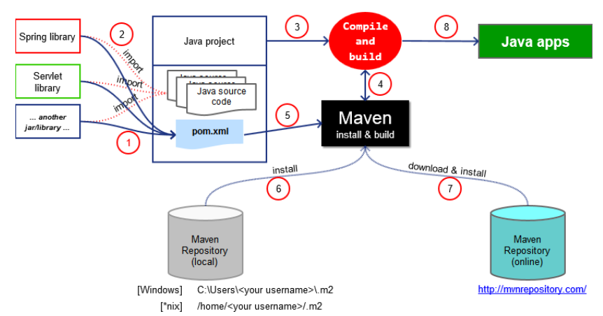

## Getting Started

This course covers the LATEST VERSIONS of Spring Boot 3, Spring 6 and Hibernate 6!

You will learn about: Spring Boot Core, Spring Boot MVC, Spring Boot Security, Spring Boot REST API, Spring Data JPA, Spring Data REST, Thymeleaf, AOP and Hibernate/JPA ... all connected to a MySQL database

By the end of this course, you will create all of the source code for a complete Spring Boot REST APIs for a full CRUD REST API real-time project.

About this course please see in [Spring Boot 3, Spring 6 & Hibernate for Beginners](https://github.com/darbyluv2code/spring-boot-3-spring-6-hibernate-for-beginners). This is a repository of this course, any thing please contact to me.

## Getting Involved

### 1. Spring Boot 3, Spring 6 & Hibernate for Beginners

#### 1.1. Spring Boot and Spring

**Spring** is a comprehensive framework for building Java applications, offering features like dependency injection, aspect-oriented programming, and robust support for enterprise technologies such as JDBC, JPA, and more.

It provides a modular approach to building applications, encouraging best practices and design patterns that promote maintainability and scalability.

**Spring Boot**, on the other hand, is built on top of Spring and aims to simplify the development process by providing a set of conventions and pre-configurations.

It eliminates much of the boilerplate configuration that developers would typically need to set up a Spring application, such as configuring dependencies, setting up servers, and defining application contexts.

Spring Boot use Spring behind the secenes, Spring Boot simply make it easier to use Spring:

- Make it easier to get started with Spring development

- Minimize the amount of manual configuration

- Perform auto-configuration based on props files and JAR classpath

- Help to resolve dependency conflicts (Maven or Gradle)

- Provide an embedded HTTP server so you can get started quickly like TomCat, Jelly, Undertow...

#### 1.2. Spring Initializr

First go to the website [Spring Initializr](https://start.spring.io/), this website will help you to create a starter Spring Boot Project more quickly. Reduces the time and effort required to set up a new Spring Boot project by providing a user-friendly interface to customize project details and dependencies.

1. Select your dependencies.

2. Creates a Maven/Gradle Project.

3. Import the project into your IDE (Eclipse, Intellij, NetBBeans..etc..)

#### 1.3. Running the Spring Boot Apps

Spring Boot Apps can be run standalone (It includes embedded server in their selfs).

**Run the Spring Boot app from the IDE or Command Line.**

```bash
java -jar <jar_name>.jar
```

Spring Boot's ability to run standalone applications with embedded servers and its ease of deployment from both IDEs and command line interfaces make it a powerful choice for developing modern Java applications. Whether you're building microservices, web applications, or RESTful APIs, Spring Boot provides the tools and capabilities to streamline your development and deployment workflows effectively.

#### 1.4. Deploying Spring Boot Apps

Spring Boot applications can be packaged as WAR files for deployment to external servlet containers like Tomcat, JBoss, WebSphere, and others. This approach allows you to leverage existing infrastructure and server configurations while still benefiting from Spring Boot's productivity features.

Deploy **WAR File (Web Application Archive)** to an **External Server**: TomCat, JBoss, WebSphere etc...

#### 1.5. Maven Project in Java

When building your Java Project, you may need additional JAR Files, For example: Spring, Hibernate, Commons Logging, JSON etc...

One approach is to download the JAR files from each project website. Or manually add the JAR files to your build path / classpath.

So we will use **Maven Solution**

- Tell the Maven the projects you are working with dependencies: Spring, Hibernate etc...
- After that Maven will go out and download the JAR files for those projects for you, and Maven will make those JAR files available during compile and run.

#### 1.6. Development Process

Just working step by step, you will create the first Spring Boot project

**Configure our project at [Spring Initializr](https://start.spring.io/)**

- **Project**: In this, you can choose depend on your demand, in this course we will use **Maven Project**.

- **Language**: In this course, the main languages we use is **Java**.

- **Spring Boot**: This is one of the most important things we need to considered. In this option, you need choose the latest released version of Spring Boot. But please avoid the **Snapshot** versions since it is the alpha and beta version of this Spring Boot.

- **Project Metadata**: In this, you will setting the name of your project and some of basic and important information for your source and project.

  - Group: This typically represents the base package name for your project. It often follows the reverse domain name convention (e.g., com.example).
  - Artifact: The artifact ID is the name of the project or module within the group. It uniquely identifies your project within the repository. (e.g., my-spring-app)
  - Name: The display name of your project. This is a human-readable name that identifies your project.
  - Description: A brief summary or description of your project's purpose and functionality.
  - Package name: The base package namespace for your Java classes. It is recommended to use a meaningful and descriptive package structure.
  - Packaging: Specifies whether the project should be packaged as a **JAR** (Java ARchive) or a **WAR** (Web Application ARchive) file.
  - Java: Specifies the Java version compatibility for your project. Spring Boot supports various Java versions depending on the Spring Boot version used.

- **Add Dependencies**: In this, click into and search the key word `Spring web` and choose the `Spring Web` to development the Spring Boot apps with **TomCat** and **Spring MVC**.

**Download the zip file**

Just click into the button **Generate** to create the zip file of sources code from the website. Then Unzip the file into your folder.

**Import the project into our IDE.**

Open your Intellij IDEA and click into open the project, after that choose the folder you just unzip and click open.

Give it some time to import the project with maven and the dependencies in the maven setting of this project.

#### 1.7 What is Spring Project

Additional Spring Modules built-on top of the core Spring framework. So use only thing you need in Spring Project. Some of famous and important thing you need to considered is:

- **Spring Cloud:** Spring Cloud is particularly useful for building microservices architectures where various services need to communicate with each other reliably and manage configuration and discovery efficiently.
- **Spring Data:** Spring Data is ideal for applications that need to interact with databases, providing a simplified and consistent approach to data access.
- **Spring Batch:** Spring Batch is a lightweight, comprehensive batch framework designed to enable the development of robust batch applications vital for the daily operations of enterprise systems. It provides reusable functions essential for processing large volumes of records, including logging/tracing, transaction management, job processing statistics, job restart, skip, and resource management.
- **Spring Security:** Spring Security is a powerful and highly customizable authentication and access-control framework for Java applications. It is the de facto standard for securing Spring-based applications. It provides comprehensive security services for Java EE-based enterprise software applications.
- **Spring Web Service:** Spring Web Services is useful for applications that need to expose or consume SOAP-based web services, providing strong support for contract-first development approaches.
- **Spring LDAP:** Spring LDAP is ideal for applications that need to interact with LDAP directories for tasks such as user authentication, directory lookups, and maintaining organizational data.

You can go to [Spring](https://spring.io/) to read the document of this framework, it not really have all things but it is one of the good practices for Spring developer.

#### 1.8 Spring Boot with Maven Project

**What is Maven ?**

Maven is a Project Management tool, most of popular use of Maven is for build management and dependencies.

When building an Java project, you may need many additional JAR files, for example: Spring, Hibernate, Commons Logging and JSON etc...

One of the traditional approach is to download the JAR file from each project website and then manual add the JAR files to your build path / classpath.

So just thinking if you are developer, you need go to each website of each JAR file to download and manual add each into your project. It very match many problems when the version is change or something. So **Maven Project** can help you manage it easily.

The Maven tell the project which dependencies the project are working with like Spring, Hibernate etc... Maven will go out and download the JAR files automatically for those project for you. It also make the JAR files is available during compile and run.

Just look at the image below, you can have the good look how maven work with your apps when compile and run.



When it retrieves a project dependency, it will also download supporting dependencies, for example: Spring depends on the common-logging... So when you give Maven to use Spring, it will be automagically download the common-logging for your project.

**Standard Directory Structure**

Normally, when you join to a new project, each development team dreams up their own directory structure, so it very not ideal for new commer and not standardized. So Maven give the standard directory structure.

```bash
└───maven-project
  ├───pom.xml
  └───src
      ├───main
      │   ├───java
      │   ├───resources
      │   ├───filters
      │   └───webapp
      ├───test
      │   ├───java
      │   ├───resources
      │   └───filters
```

So we will need to know which directory is doing for what, by the description below we can have the overview of each folder in project.

- src/main/java: This is an folder to store your Java code for your project.
- src/main/resources: Properties, Config files used by your apps.
- src/main/webapp: JSP Files and web config files other web assets (image, css, js, etc...)
- src/test: Unit testing code and properties.
- target: Destination directory for compiled code, automatically created by Maven.

If you are working with the web apps project, you will put your asset in the `src/main/webapp`. In this you will place the `JSP` files, or any `configuration` files, `CSS` files and images and so on.

```bash
maven-project/
├── pom.xml
├── src/
│   ├── main/
│   │   ├── java/
│   │   │   └── com/
│   │   │       └── example/
│   │   │           └── maven-project/
│   │   │               ├── maven-project.java
│   │   │               └── ...
│   │   ├── resources/
│   │   │   └── application.properties
│   │   ├── webapp/
│   │       ├── WEB-INF/
│   │       │   ├── web.xml
│   │       │   └── ...
│   │       ├── META-INF/
│   │       │   └── context.xml
│   │       └── static/
│   │           ├── css/
│   │           │   └── style.css
│   │           ├── js/
│   │           │   └── script.js
│   │           └── index.html
│   └── test/
│       ├── java/
│       │   └── com/
│       │       └── example/
│       │           └── maven-project/
│       │               ├── maven-project.java
│       │               └── ...
│       └── resources/
├── target/
└── ...
```

The benefit of this structure folder is: It is easy for new developer joinning a projedts. They can easily find code, properties file, unit test, web file etc...

**Maven Key Concepts**

**POM (Project Object Model)**: Configuration file for your project, and always located in the root of your Maven project.

**POM File Structure**: POM file structure include three important information in the `pom.xml`, now we will see detail each information.

- `project meta data`: It include the Project name, Version and Output File Type: JAR, WAR, etc...

- `dependencies`: This is list of projects we depend on like Spring, Hibernate, etc...

- `plug-ins`: Additional custom tasks to run like generate JUnit test report, etc...

Some of the basic simple `pom.xml` file you can see below

**Project coordinates:** The project coordinates uniquely identify the project and are used to manage dependencies. The **group ID**, **artifact ID**, and **version** number must be specified.

| Name        | Description                                                                                                   |
|-------------|---------------------------------------------------------------------------------------------------------------|
| Group ID    | Name of company, group or organization. Convention is use to reverse domain name **com.example**              |
| Artifact Id | Name for this project                                                                                         |
| Version     | A specific release version like: **1.0, 2.0**... If project is under active development then **1.0-SNAPSHOT** |

```xml
<groupId>com.example</groupId>
<artifactId>my-project</artifactId>
<version>1.0.0</version>
```

**Dependencies**: This section lists all the dependencies required by the project. Maven automatically downloads and includes these dependencies in the project.

```xml
<dependencies>
  <dependency>
    <groupId>org.springframework.boot</groupId>
    <artifactId>spring-boot-starter-web</artifactId>
  </dependency>
  <dependency>
    <groupId>org.springframework.boot</groupId>
    <artifactId>spring-boot-starter-test</artifactId>
    <scope>test</scope>
  </dependency>
</dependencies>
```

**Build configuration**: This section specifies how the project should be built and includes information such as the project’s source code directory, output directory, and any plugins required for the build.

```xml
<build>
  <plugins>
    <plugin>
      <groupId>org.springframework.boot</groupId>
      <artifactId>spring-boot-maven-plugin</artifactId>
    </plugin>
  </plugins>
</build>
```

**Plugins**: Maven plugins are used to extend the build process. This section lists all the plugins required by the project.

```xml
<plugin>
  <groupId>org.springframework.boot</groupId>
  <artifactId>spring-boot-maven-plugin</artifactId>
</plugin
```

### 2. Spring Boot - Create a REST Controller

#### 2.1 Create a REST Controller

Create a new Java class in your project. For instance, let's name it `SpringRestController.java`.

This class will handle HTTP GET requests to the root URL `("/")` and return a simple `"Hello World!"` message.

```java
import org.springframework.web.bind.annotation.GetMapping;
import org.springframework.web.bind.annotation.RestController;
@RestController
public class SpringRestController {
    @GetMapping("/")
    public String sayHello() {
        return "Hello World!";
    }
}
```

In this setup, we use the `@RestController` and `@GetMapping` `annotations`. These `annotations` play `crucial roles` in defining the behavior of the REST controller.

> **`@RestController` Annotation**

**Definition:** The `@RestController annotation` is a specialized version of the @Controller annotation. It is a convenience annotation that **combines** `@Controller and @ResponseBody`, eliminating the need to annotate every request handling method with `@ResponseBody`.
**Purpose:** It indicates that the class is a REST controller where each method returns a domain object instead of a view. The response is automatically serialized into JSON or XML and sent back to the client.

> **`@GetMapping` Annotation**

**Definition:** The `@GetMapping annotation` is a composed annotation that acts as a shortcut for `@RequestMapping(method = RequestMethod.GET)`.
**Purpose:** It is used to map HTTP GET requests to specific handler methods. In this example, it maps GET requests to the root URL **("/")** to the `sayHello` method.

#### Frequently Asked Questions

```bash
1. Does Spring Boot replace Spring MVC, Spring Rest etc... ?
```

No. Instead, Spring Boot actually uses those technologies.

```bash
2. Does Spring Boot run code faster than regular Spring Code?
```

No, Behind the scenes, Spring Boot uses same code of Spring Framework.

So remember, spring boot is about making it easier to get started like minimizing configuration etc...
